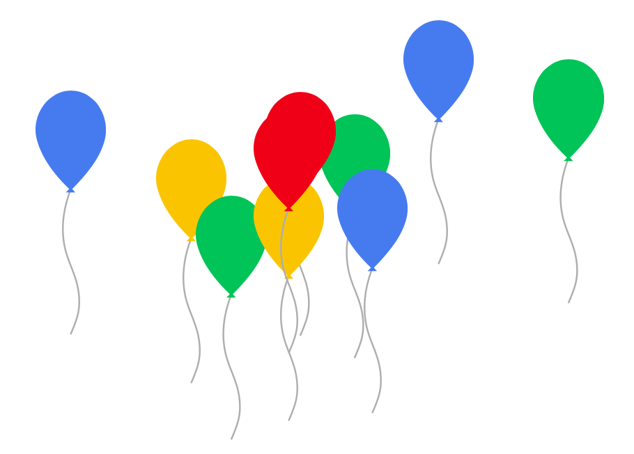

# Balloon.js

Multi-color balloons expanding and flying up from the bottom of your screen.

**WARNING: DO NOT SUPPORT IE.**

## Preview


[Preview Link](https://mi.js.org/balloon.js/sample.html)

## Feature

- No jQuery.
- Small size, less than 4Kb.
- Easy to implement, simple configuration.
- You do not have to be a web developer to use it.

## How to use

Download:
```bash
# Clone this repository
git clone https://github.com/stevenjoezhang/balloon.js.git
# Go into the repository
cd balloon.js
```
then add this script to your html page:
```xml
<script src="path/to/balloon.js"></script>
```
or:
```xml
<script src="path/to/balloon.min.js"></script>
```

### Using CDN

```xml
<script src="https://cdn.jsdelivr.net/npm/balloon.js@0/balloon.min.js"></script>
```

## Config

- `duration` the animation duration in seconds
- `size` size of the balloons in px
- `count` count of the balloons
- `from` l for left, r for right
- `to` l for left, r for right

For example:
```xml
<script src="path/to/balloon.min.js" duration="15" size="88"></script>
```

## Credits

* [Mimi](https://zhangshuqiao.org) Developer of this project.

## License

Released under the GNU General Public License v3  
http://www.gnu.org/licenses/gpl-3.0.html

## TODO

- Relative size
